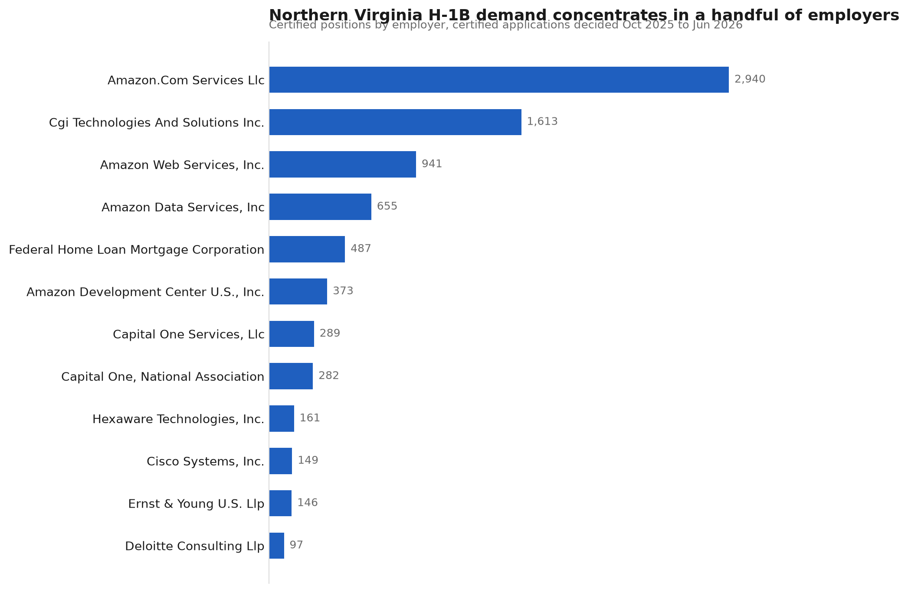
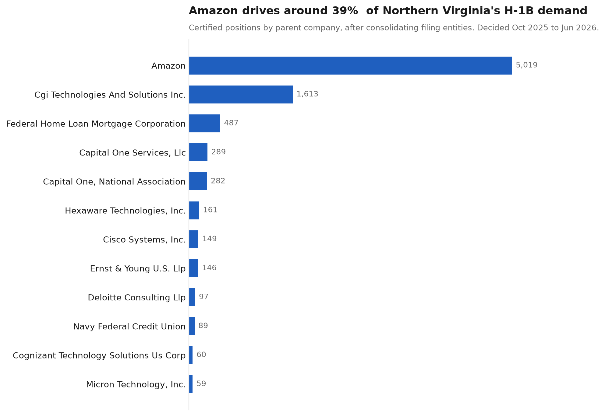
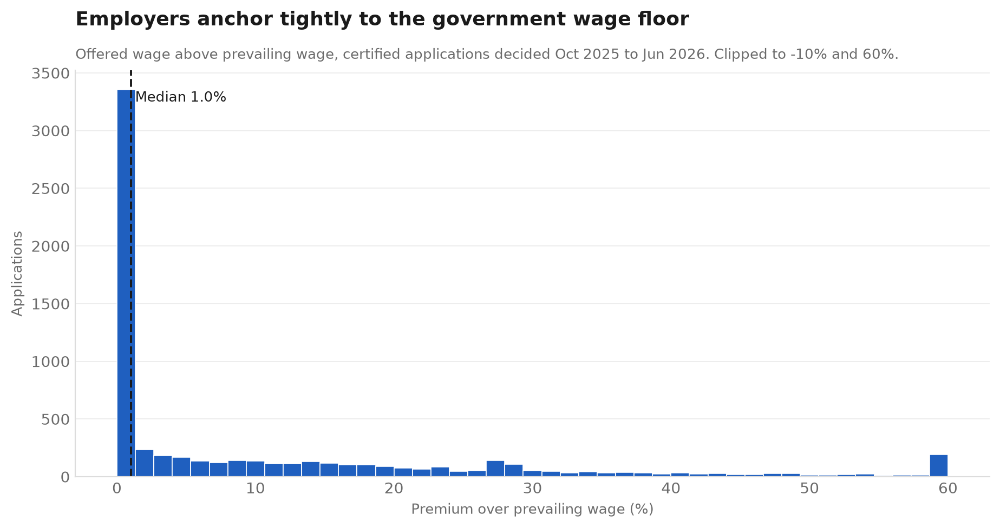

# H-1B Labor Certification Analysis: Northern Virginia

Which employers and occupations drive H-1B demand in Northern Virginia, and how
much do they pay relative to the government's prevailing wage floor?

Built from U.S. Department of Labor disclosure data using Python and pandas.



## Background

Before an employer can petition USCIS for an H-1B worker, it must first file a
**Labor Condition Application (LCA)** with the Department of Labor. On that form
the employer states the job title, worksite, number of positions, the wage it
will pay, and the government-determined prevailing wage for that occupation in
that area. The employer attests it will not pay below the local market rate.

Every certified LCA is public record. Because the LCA precedes the petition, it
is a leading indicator of hiring intent rather than a record of visas issued.

## Data

**Source:** [DOL Office of Foreign Labor Certification, Performance Data](https://www.dol.gov/agencies/eta/foreign-labor/performance)
— file `LCA_Disclosure_Data_FY2026_Q3.xlsx`, 437,496 records, 98 columns.

**Coverage window.** The filename implies a fiscal-year quarter, but the file is
defined by **decision date**, not filing date. `DECISION_DATE` runs 2025-10-01 to
2026-06-30, while `RECEIVED_DATE` reaches back to January 2021 for applications
that sat pending for years. All figures below describe applications *decided*
between October 2025 and June 2026.

## Scope and inclusion criteria

Three filters were applied, each an explicit choice rather than a default:

**Visa class.** The file bundles H-1B with E-3 (Australian) and H-1B1 (Chile,
Singapore), which are separate treaty programs with different rules. Only
`VISA_CLASS == "H-1B"` was kept, leaving 426,952 records.

**Case status.** Only `Certified` records were kept. A further 25,546 records
carry status `Certified - Withdrawn`, meaning DOL approved the application and
the employer later pulled it, often because the H-1B lottery was not won or the
hire fell through. Counting those as demand would overstate it. This exclusion is
the single most consequential judgment call in the analysis and is stated here so
a reader can disagree with it.

**Geography.** Northern Virginia is defined as the Northern Virginia Regional
Commission jurisdictions: Arlington, Fairfax, Loudoun and Prince William
counties, plus the independent cities of Alexandria, Fairfax, Falls Church,
Manassas and Manassas Park. Stafford and Fauquier are excluded.

The `WORKSITE_COUNTY` field is inconsistently populated, storing the same
jurisdiction as both `FAIRFAX COUNTY` (4,047 records) and `FAIRFAX` (134). Naive
string matching would have silently dropped the second form. Stripping the
`COUNTY` and `CITY` suffixes before matching collapses the variants onto one base
name, which is safe because the frame is already restricted to Virginia.

**Result: 6,609 certified H-1B applications covering 12,950 positions.**

## Wage normalization

Wages in the source file are not comparable as stored. The rate lives in
`WAGE_RATE_OF_PAY_FROM` and the pay period in a separate `WAGE_UNIT_OF_PAY`
column, so an hourly rate of 56 and an annual salary of 126,000 sit in the same
column with no indication that they are different units.

419 Northern Virginia records (6.3%) used a non-annual pay period. Each was
converted to an annual figure: hourly × 2,080, weekly × 52, bi-weekly × 26,
monthly × 12. The median non-annual record reads **$56 as stored** and
**$115,939 once annualized.**

Values were then validated against a plausibility range of $15,000 to $2,000,000.
Five records (0.08%) failed: one unparseable, and four where the wage is clearly
correct but the pay unit is not.

| Employer | Wage stated | Unit stated | Implied annual |
|---|---|---|---|
| Palo Alto Networks, Inc. | 156,291 | Hour | $325,085,280 |
| ZipRecruiter, Inc. | 165,000 | Hour | $343,200,000 |
| Insight Direct USA, Inc. | 160,000 | Week | $8,320,000 |
| Elasticsearch, Inc. | 180,000 | Week | $9,360,000 |

These are annual salaries filed with the wrong pay period selected, a data entry
error in federal filings by four large employers. They are excluded from wage
statistics rather than silently retained.

`WAGE_RATE_OF_PAY_FROM` is the floor of the offered range. Using the floor rather
than the midpoint is the conservative choice.


## Entity resolution

Employers file under the exact legal entity responsible for the petition, so one company can appear many times in the same ranking. Names are resolved to parents in two passes: normalization strips punctuation and legal suffixes such as Inc, LLC, and Corporation, then an explicit map of known multi-entity filers merges the rest, matched on whole words. 
The map is deliberate rather than fuzzy. Automatic similarity matching merges genuinely separate companies and leaves no record of its decisions. Every merge here is listed in `outputs/entity_merge_report.csv` so a reader can audit or reject any individual decision.
21 parents were assembled from more than one filing entity. Several of the smaller merges are the same employer recorded with inconsistent capitalization rather than distinct subsidiaries, a separate data quality issue in the source.
 
## Findings

**Demand is highly concentrated in a single employer.** 2,032 entities filed applications, but many large employers file under multiple legal names. After resolving entities to parent companies, Amazon accounts for 5,019 certified positions, **38.8%** of the region's total, filed across 12 separate legal entities. Top-10 concentration rises from **60.9%** by filing entity to 64.3% by parent company. This is only visible after entity resolution. Ranked by raw `EMPLOYER_NAME`, Amazon's twelve filings scatter across the list and the largest single row shows 2,940 positions, understating the company's real share by nearly half.




**The occupation mix is narrow.** Across 200 distinct SOC occupations, Software
Developers alone represent **37.3%** of certified positions.

**Fairfax dominates geographically**, at 63.3% of applications, ahead of
Arlington and Loudoun.

**Employers anchor tightly to the wage floor.** Median offered salary is
**$126,090** (25th percentile $105,000, 75th percentile $154,486), and the median
premium over the stated prevailing wage is **1.0%**.



That last figure needs care. The prevailing wage has four skill levels and the
employer selects which applies. A 1.0% premium does not demonstrate underpayment.
It shows that once an employer selects a wage level, the offer is set at or barely
above that floor.

## Limitations

- **LCAs are intent, not outcomes.** A certified LCA is not an approved H-1B.
  Employers routinely file for more positions than they fill, so counts run high.
- **Entity resolution is partial.** Only the multi-entity filers listed in `PARENT_RULES` are consolidated. Smaller companies filing under several names remain split, so the concentration figures reported here are a floor rather than a ceiling.
- **Primary worksite only.** This analysis uses the worksite recorded on the main
  disclosure file. Employers headquartered elsewhere with additional Northern
  Virginia worksites listed in `LCA_Worksites` are not captured. Joining that
  file is the planned next revision.
- **One quarter of one fiscal year.** No trend claims are made.

## Reproducing this

```bash
git clone https://github.com/aashishkolisetty/h1b-nova-analysis.git
cd h1b-nova-analysis
python3 -m venv .venv && source .venv/bin/activate
pip install pandas openpyxl pyarrow matplotlib
```

Download `LCA_Disclosure_Data_FY2026_Q3.xlsx` from the DOL link above into
`data/raw/`, then run the pipeline in order:

```bash
python src/step1_load.py       # read the Excel file once, cache as Parquet
python src/step2_profile.py    # profile the columns before filtering
python src/step3_filter.py     # apply visa, status and geography filters
python src/step4_wages.py      # annualize and validate wages
python src/step5_analyze.py    # aggregate, chart, and write findings
python src/step6_entities.py   # resolve entities to parent companies
```

The raw data is not committed. The source file is several hundred megabytes and
is available directly from DOL.

## Repository structure

```
data/raw/          source files, not committed
data/processed/    cached intermediates, not committed
outputs/           charts, CSVs, and summary.md
src/               the six pipeline steps
```

## Author

Aashish Kolisetty · B.S. Business Information Technology, Virginia Tech
[linkedin.com/in/aashishkolisetty](https://www.linkedin.com/in/aashishkolisetty)
